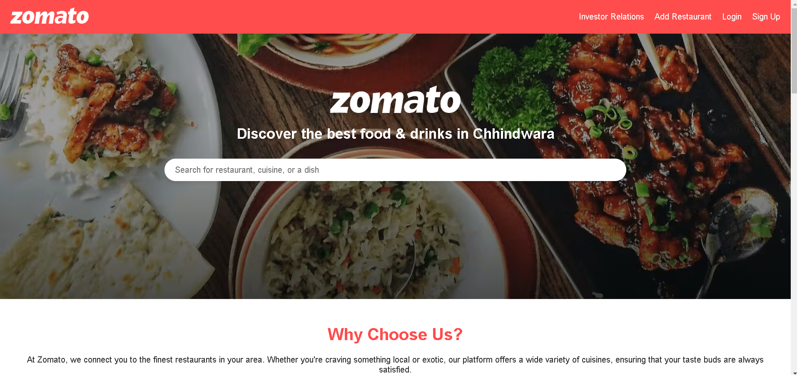

# Zomato Clone Project

This project is a clone of the Zomato Website, created using HTML, CSS, and JavaScript. It includes responsive design and interactive features that work across devices, such as mobile, tablet, and desktop. This project aims to replicate the Zomato UI and improve my frontend development skills.

## Table of Contents
- [Features](#features)
- [Demo](#demo)
- [Technologies Used](#technologies-used)
- [Setup and Installation](#setup-and-installation)
- [Folder Structure](#folder-structure)
- [Gallery](#gallery)
- [License](#license)

## Features
- Responsive design for all devices.
- Interactive features, including dropdowns, modals, and navigation.
- Home, product, and search pages styled similarly to Amazon’s interface.
- Dynamic content loading using JavaScript.

## Demo
 

## Technologies Used
- *HTML5* for the structure.
- *CSS3* for styling and layout.
- *JavaScript* for interactivity and responsiveness.

## Setup and Installation
1. Clone the repository:
   git clone https://github.com/itsalokbarnwal/zomato-clone-project.git
2. Navigate to the project directory:
   cd zomato-clone-project
3. Open index.html in your browser to view the website locally.

## Folder Structure
- index.html - Main HTML file
- style.css - CSS file for styling
- script.js - JavaScript file for functionality
- gallery/ - Folder containing images and assets for the site

## Gallery
Screenshots and assets related to the project can be found in the gallery folder.

## License
This project is licensed under the MIT License.
